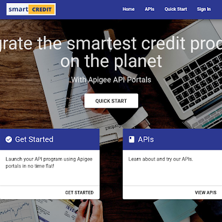

# smart-credit
Demo of a smartCREDIT solution that allows customers to apply for credit and book value-added features additionally.

The fictional online subsidiary of a major bank "smartCREDIT" offers financing for home and consumer investments with a new component called HomeMaintenance+.  HomeMaintenance+ gives the consumer a rebate on their yearly bill when the consumer takes a photograph once a year of the financed object, which is then analyzed by the Google Vision / Google AutoML Vision services for maintenance needs, and if found to be in a less-than-optimal condition, recommends home maintenance providers from the bank's service network, with a best price guarantee for the consumer.

This is a win-win for the bank and the consumer - the bank makes sure the consumer is properly maintaining the invested object (and keeping a high resale value), and the consumer is nudged to keep up with maintenance for expensive investments, which also protects his/her investment in the long run, and all with a best-price guarantee from the bank's chosen network of service providers (who are also customers and users of the bank).

This ecosystem is maintained through APIs integrating with smartCREDIT's web site, mobile consumer app, and all of the service providers.  New providers and features can be added to the network through self-service in smartCREDIT's API portal.

# Deployment
After cloning this repository, simply initialize the Firebase project in the root directory using the firebase CLI and calling 'firebase init'.  Then call 'firebase serve' to launch a local version.

# Apps

## smartCREDIT Web Site
[Demo version](https://smart-credit-cfc36.firebaseapp.com/)

Apply for financing for a new swimming pool on the smartCREDIT web site.

## smartCREDIT API Portal
[Demo version](https://tyayers-eval-smartcreditportal.apigee.io/)

The smartCREDIT API Portal allows service providers and third party apps to connect to the smartCREDIT ecoystem. Note: Currently the APIs are not correctly rendered in the portal due to a bug.

## smartCREDIT Hub

[Demo version](hhttps://smart-credit-cfc36.firebaseapp.com/app)

The smartCREDIT Hub app is used by consumers to manage their credit, and take maintenance photos and connct with HomeMaintenance+ service providers.

#Demo Guide
To demo simply click on the Discover button in the web site, and then go to the Hub app to click on the reminder to take a yearly photo, and if the pool is found to be in need of maintenance, to contact a service provider to schedule an appointment.
