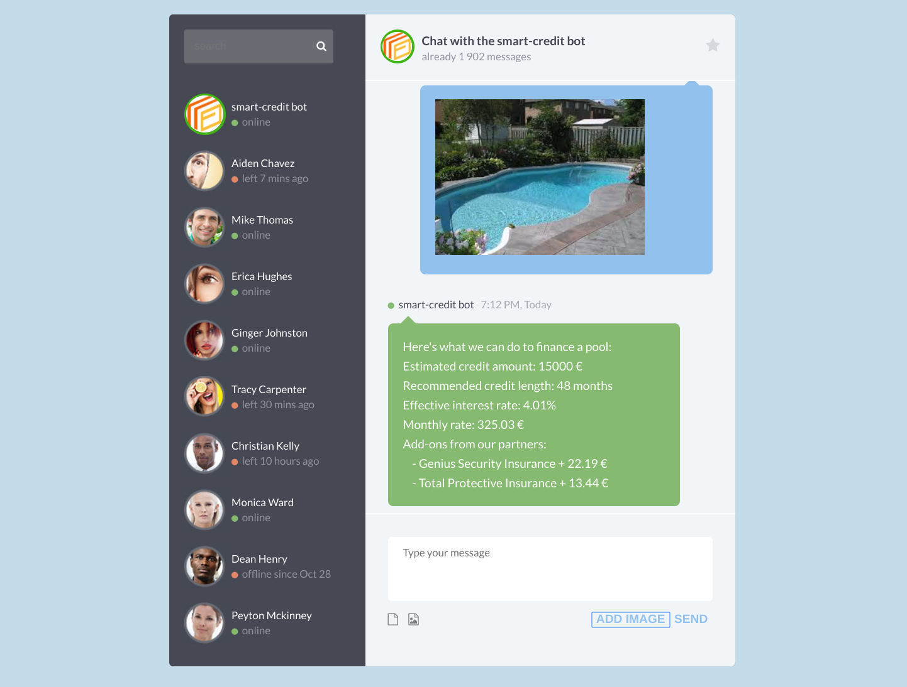

# Apibank API Ecosystem Showcase
This is a showcase demo of how APIs can define both an internal and external ecosystem strategy and architecture.  As is demonstrated here, an API-First digital strategy is the cornerstone of a larger internal and ecosystem strategy and transformation.

Apibank is a fictional online bank and financing provider who has a variety of financing packages available for consumers and businesses.  They are known for their low rates and consumer-friendly approach, always looking for creative ways to reach their customers, and fulfill their financing needs.  Their latest feature is an **Instant Credit** feature that allows customers to just upload a photo of an object to finance, and Apibank evalutates the object using the Google Vision API image recognition technology, and tailors a financing offer based on the image data, customer credit history, and other data points.  They are also looking to radically open themselves to partner and ecosystem integrations to expand their business.

## Customize Demo
This demo can be customized by double clicking on the 

Apibank as completed the first stage of this transformation, and has executed on these three scenarios:

## Scenario 1: Internal Web Portal Team
The internal web portal team used to integrate the backend services team's APIs directly, but now they use the Apibank API Hub for all of their integration needs.  If it doesn't exist in the API Hub, then it doesn't exist for them to use.  This addresses their core business use case, and has made their internal development much faster and more effective.

## Scenario 2: Partner Ecosystem for Insurance Providers
Apibank has recognized that when customers are financing an expensive new purchase, they also need the peace of mind that in case something goes wrong, they're also covered.  So for this reason it is a natrual extension to integrate insurance providers into the Apibank ecosystem, but how?

The answer is through clear and transparent APIs tailored for this purpose, so Apibank has defined their **Insurance Provider API**, and published it as a product on their API Hub.  Through API Evangelism, good documentation, and easy integration and testing they already have the first providers integrated, and have opened up a new business by reselling insurance along with their credit products.

## Scenario 3: New Channels To Reach Customers
A further advantage to defining their internal communication through APIs in **Scenario 1** is that Apibank is now prepared to offer their core business APIs to external developers, which makes it easy to execute on new channel integrations - it's all clearly documented and testable in the API Hub, and so within a day a developer of a new Chat and Messaging app has integarted the Apibank Bot to provide consumers with credit and insurance offers directly in their chat interface (including the Instant Credit image recognition functionality!) 

Based on the very successful implentation of these scenarios, Apibank has already managed to grow its customer base, and has been awared with several technology innovation awards within the industry.  Suddenly it's also easier to attract new talent, partners and customers with so much positive buzz around their successful API innovation approach.

## Demo Apps

[Apibank Web Portal](https://smart-credit-cfc36.firebaseapp.com/)

This is the Apibank web portal, where customers can get their financing approved with 1-click, and use the Instant Credit feature based on image recognition using the Google Cloud Vision API.  Click on the **Try Instant Credit using Google ML** button to use Instant Credit.

[Apibank API Hub](https://emea-poc13-smartcredit.apigee.io/)

The Apibank API Hub has the API products published for different audiences (core credit and insurance providers), as well as app registration for developers, and the terms & conditions for all API clients.

[Ecosystem Chat & Messaging App](https://smart-credit-cfc36.firebaseapp.com/chat.html)

Because the Apibank team has published its core business APIs for both internal and external use, it's easy for app developers to add financing functionality to their apps.  Just send a picture to the smart-credit bot, and you will get your financing offer instantly, just like at the credit portal.

## Demo Screencast

## Architecture

## Deployment

### Frontends

1. Create a Firebase project at firebase.google.com
2. Clone this repository, install the Firebase Tools and call 'firebase init' in the root **/frontend** directory to link to your firebase project.
3. Test by calling 'firebase serve' to host locally and test.  
4. Alternatively you can use any other static hosting to serve the frontend content

### Backend

Note: The backend service in the Knative directory can be deployed to any container host, the instructions below are for deploying to [Google Cloud Run](https://cloud.google.com/run/).

1. Build and push the container in the Knative directory to [Google Container Registry](https://cloud.google.com/container-registry/docs/pushing-and-pulling#pushing_an_image_to_a_registry).  If you want to use a custom AutoML Vision dataset for image recognition, then you must also configure a privatekey under privatekey.json in the knative directory.
2. Deploy the pushed container to [Cloud Run](https://cloud.google.com/run/docs/deploying#service)
3. Configure the environment variables VISIONKEY with your Google Cloud Vision API key, FBKEY with your Firebase database access key, FBPROJECT with your Firebase project name, and the key FBDOMAIN with the root domain of your Firebase project. The keys are used to access the Firestore database, so fore more information on which keys are needed see docs here: [Firestore Getting Started](https://firebase.google.com/docs/firestore/quickstart#initialize)
4. Configure the Cloud Run service URL as the target endpoint in your Apigee API Proxy.
